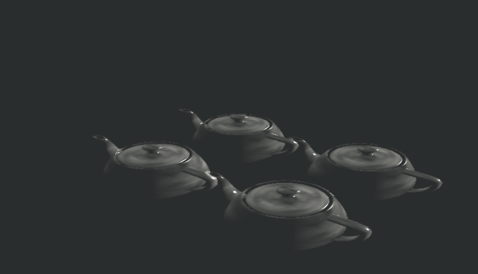

# Projet de shaders avec RenderMonkey 

Implémentation d'un rendu indirect.
Le rendu est éffectué dans une passe finale en combinant plusieurs textures avec le modèle d'éclairement de Phong. 

L'éclairage final de la scène est donc produit par une combinaison des textures obtenues lors de passes 
de rendu précédentes. 

## Résultat

